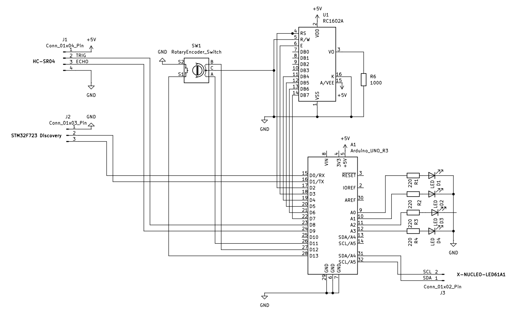

# STM32 IoT Server Guardian & LAN Bridge


An advanced, hardware-in-the-loop IoT Server Guardian built on the **STM32 B-U585I-IOT02A** discovery board. This project acts as a local security node, monitoring physical space and network status, while securely synchronizing data with the **ThingSpeak Cloud** via HTTP requests using NetXDuo.

---

## 🔗 Wi-Fi Foundation & Prerequisites

This project relies on a highly stable Wi-Fi & NetXDuo driver configuration. The low-level network foundation used in this project was developed and documented in a separate repository.

If you are struggling with EMW3080 Wi-Fi connectivity on this board, please refer to my base configuration guide first:

👉 **[STM32-B-U585I-IOT02A_WiFi-Fix](https://github.com/vvojcik/STM32-B-U585I-IOT02A_WiFi-Fix)**

---

## 🚀 Core Hardware Features

A custom PCB shield was designed in KiCad to interface with the STM32 board.
*(See `/KiCad_Board` folder for schematics.)*



1. **Always-On Status Monitor:** Integrates a classic **16x2 LCD** with a **Rotary Encoder** to display local IP, Wi-Fi signal strength, and the latest cloud commands without needing an external PC.
2. **Intrusion Detection:** Utilizes an **HC-SR04** ultrasonic sensor mounted near the server. If physical proximity changes drastically, it triggers an immediate local alarm and updates the ThingSpeak security channel.
3. **Visual Cycle Tracking:** A custom 4-LED progress bar physically visualizes the 120-second cloud-sync heartbeat (each LED representing a 30-second interval).
4. **UART Dashboard Bridge:** Features a dedicated serial link to an external **STM32F723 Discovery Kit** to render a high-fidelity visual dashboard of sensor data. *(Note: SG90 Servo integration for physical hard-reset is currently in development.)*

---

## 📂 Modular Architecture

The repository is structured to maintain a clean separation between network middleware, core MCU logic, and external hardware modules:

```text
├── Core/                   # Main application loop and MCU hardware init
├── Drivers/BSP/            # Patched MXCHIP EMW3080 Wi-Fi drivers (mx_wifi)
├── Hardware_Modules/       # Peripheral abstraction layer
│   ├── HCSR04_Sonar/       # Distance measurement logic
│   ├── LED61A1_Matrix/     # Visual feedback logic
│   ├── SG90_Servo/         # (Future) PWM control for physical button pressing
│   └── TFT_Dashboard/      # Serial communication for external F723 display
├── KiCad_Board/            # Custom PCB schematics and layout
│   ├── Straznik_Serwera_STM32.kicad_sch
│   ├── Straznik_Serwera_STM32.kicad_pcb
│   └── Straznik_Serwera_STM32.kicad_pro
├── NetXDuo/App/            # HTTP Client, 120s heartbeat, and ThingSpeak logic
└── docs/                   # Project documentation
    ├── images/             # Schematic PNG exports
    └── schematics/         # Schematic PDF exports
```

---

## ⚙️ Configuration

Before building the project, update the placeholders in the application headers:

1. Set your Wi-Fi credentials in `Core/Inc/mx_wifi_conf.h`.
2. Configure your specific ThingSpeak API Keys (Write/Read) in `NetXDuo/App/app_netxduo.h`.
3. Make sure the custom shield is properly connected to the Arduino-compatible headers (D0–D15, A0–A3) as described in the KiCad schematic.

---

## 🛠️ How to Build & Run (Standalone Setup)

This repository is fully self-contained. All necessary HAL drivers, Azure RTOS/ThreadX kernels, and NetXDuo network stacks are included directly within the project folders. No external MCU firmware packages are required.

Follow these simple steps to launch the project:

### 1. Import into STM32CubeIDE

1. Open **STM32CubeIDE** (v1.15.0 or newer recommended).
2. Go to **File → Import... → General → Existing Projects into Workspace**.
3. Click **Browse...** next to *Select root directory* and choose the cloned repository folder.
4. In the projects list, check **only** the main project: `Nx_MQTT_Client`. Leave any standalone middleware samples unchecked.
5. Click **Finish**.

### 2. Compile the Project

1. Right-click on the `Nx_MQTT_Client` project in the *Project Explorer* and select **Clean Project**.
2. Click the **Hammer icon (Build Project)** on the top toolbar or press `Ctrl + B`.
3. The project will compile locally, creating a fresh, independent build without any broken absolute path dependencies.

### 3. Flash to Board

1. Connect your **STM32 B-U585I-IOT02A** board to your PC via USB (ST-LINK port).
2. Right-click on the project → **Run As → STM32 Cortex-M C/C++ Application**.